<a id="readme-top"></a>

<div align="center">



<br />
<br />

<a href="mailto:limaabayonli170@gmail.com"></a>
<!-- TODO: décommenter et compléter quand ton profil LinkedIn est prêt
<a href="https://www.linkedin.com/in/TODO"></a>
-->
<a href="https://www.facebook.com/profile.php?id=100086574069663"></a>


<br />
<br />

**Je conçois et développe des applications web complètes, de l'API Laravel à l'interface React.**
<br />
Du modèle de données au déploiement, je livre des produits rapides, sécurisés et faciles à maintenir.

</div>

<br />

## 👋 À propos

```php
<?php

declare(strict_types=1);

final readonly class Developer
{
    public function __construct(
        public string $name     = 'YONLI Limaaba',
        public string $location = 'Burkina Faso 🇧🇫',
        public string $role     = 'Développeur Full-Stack',
        public array  $backend  = ['PHP 8', 'Laravel', 'API REST', 'Sanctum / Passport'],
        public array  $frontend = ['React', 'Vite', 'Tailwind CSS', 'Blade', 'Bootstrap'],
        public array  $data     = ['MySQL', 'SQLite'],
    ) {}

    public function currentFocus(): array
    {
        return ['Laravel 13', 'React 19', 'Tests automatisés avec PHPUnit'];
    }
}
```

## 🧭 Ce que j'apporte

<table>
  <tr>
    <td width="33%" valign="top">
      <h3>⚙️ Back-end &amp; API</h3>
      <p>APIs REST avec Laravel, authentification sécurisée (Sanctum, Passport), modélisation de bases MySQL et tests PHPUnit.</p>
    </td>
    <td width="33%" valign="top">
      <h3>🎨 Interfaces</h3>
      <p>Applications React et Vite, interfaces responsives avec Tailwind CSS, pages optimisées pour le référencement (SEO).</p>
    </td>
    <td width="33%" valign="top">
      <h3>🚀 Livraison</h3>
      <p>Un seul interlocuteur du cahier des charges à la mise en ligne : versioning Git, déploiement et maintenance.</p>
    </td>
  </tr>
</table>

<p align="right"><a href="#readme-top">⬆️ Retour en haut</a></p>

## 🛠️ Stack technique

| Domaine | Technologies |
| :-- | :-- |
| **Back-end** |  |
| **Front-end** |  |
| **Données** |  |
| **Outils** |  |

<details>
<summary><b>Autres langages pratiqués</b></summary>

<br />


</details>

<p align="right"><a href="#readme-top">⬆️ Retour en haut</a></p>

## 🚀 Projets à la une

<table>
  <tr>
    <td width="50%" valign="top">
      <h3>🏢 Prosperity Consulting International</h3>
      
      <p>Site vitrine React (pages services, secteurs d'activité, SEO) adossé à une API Laravel 13 sécurisée par Sanctum.</p>
      <p>
        
        
        
      </p>
      <!-- TODO: confirmer avec le client que tu peux le citer, puis remplacer par le vrai lien -->
      <!-- <a href="https://TODO"><b>🌐 Voir le site</b></a> -->
    </td>
    <td width="50%" valign="top">
      <h3>🌦️ <a href="https://github.com/limaaba/react-weather-app">React Weather App</a></h3>
      
      <p>Application météo en React connectée à l'API OpenWeatherMap et déployée sur Vercel.</p>
      <p>
        
        
        
      </p>
      <a href="https://react-weather-app-liart-seven.vercel.app"><b>▶ Démo</b></a> · <a href="https://github.com/limaaba/react-weather-app"><b>Code source</b></a>
    </td>
  </tr>
  <tr>
    <td width="50%" valign="top">
      <h3>📦 Gesstock</h3>
      <!-- TODO: si c'est un fork, remplacer le badge par "Personnalisation" et préciser ce que tu as ajouté -->
      
      <p>Application de caisse et de gestion de stock : produits, achats, ventes, factures PDF, codes-barres et exports Excel.</p>
      <p>
        
        
        
      </p>
    </td>
    <td width="50%" valign="top">
      <!-- TODO: donner un vrai nom à ce projet -->
      <h3>🧩 Application full-stack Laravel + React</h3>
      
      <!-- TODO: remplacer par une phrase qui dit ce que fait l'application et pour qui -->
      <p>Architecture découplée : une API Laravel indépendante consommée par une application React/Vite.</p>
      <p>
        
        
        
      </p>
      <a href="https://github.com/limaaba/backend"><b>Back-end</b></a> · <a href="https://github.com/limaaba/frontend"><b>Front-end</b></a>
    </td>
  </tr>
</table>

<div align="center">

<a href="https://github.com/limaaba?tab=repositories"></a>

</div>

<p align="right"><a href="#readme-top">⬆️ Retour en haut</a></p>

## 🌱 En ce moment

- 🔭 Je construis des applications **API Laravel 13 + React 19**.
- 📚 J'approfondis les **tests automatisés** (PHPUnit) et l'architecture d'API.
- 🤝 Je suis ouvert aux **collaborations**, en particulier sur des projets pour l'Afrique de l'Ouest.

## 📈 Activité

<div align="center">

<picture>
  <source media="(prefers-color-scheme: dark)" srcset="https://raw.githubusercontent.com/limaaba/limaaba/output/github-snake-dark.svg" />
  
</picture>

<br />

<picture>
  <source media="(prefers-color-scheme: dark)" srcset="https://streak-stats.demolab.com/?user=limaaba&locale=fr&theme=github-dark-blue&hide_border=true&background=00000000" />
  
</picture>

</div>

<p align="right"><a href="#readme-top">⬆️ Retour en haut</a></p>

## 🤝 Travaillons ensemble

<div align="center">

Vous avez un projet web, une API à construire ou une application à moderniser ?
<br />
Parlons-en : je réponds généralement sous 24 heures.

<br />
<br />

<a href="mailto:limaabayonli170@gmail.com"></a>

<br />
<br />

<sub>Burkina Faso 🇧🇫</sub>

</div>
